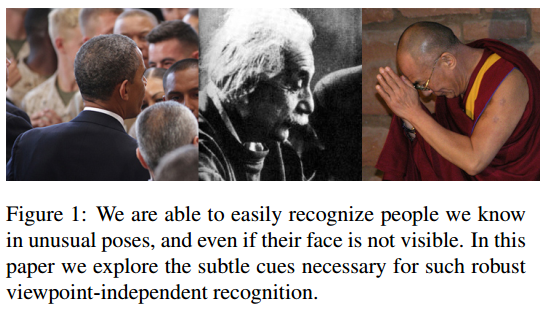
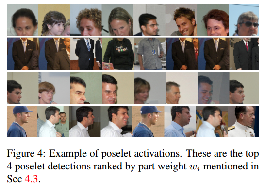

# Beyond Frontal Faces: Improving Person Recognition Using Multiple Cues

&emsp;&emsp;**本文解决了unconstrained setting的情况下，人物身份识别问题。主要做了2个方面的贡献：**
&emsp;&emsp;1.提出了一个针对unconstrained setting 人物识别问题的数据集PIPA:
&emsp;&emsp;2.提出了解决unconstrained setting 人物识别问题的方法PIPER，该方法由3部分组成：
global recognizer+poselet-level person recognizer+face recognizer

## 1.Introduction

&emsp;&emsp;对我们人类来说，识别具有各种姿势的人物是很简单的事情，如图1所示。即便缺少比较清晰的正脸，我们也可以利用其它的相关信息，例如头发、衣服、眼镜、姿态等等。然而，像图1那样的示例，却超出了最先进的 face recognizers的能力。尽管基于正脸的人脸识别已经取得了非常大的进步，在相册中看不到正脸的情况才更普遍。例如，在我们构建的数据集中，只有52%的人有比较清晰的正脸，有较好的人脸识别效果。因此，从各种视角或者看不到正脸的情况下识别人物是一个巨大的挑战，然而它并未受到足够的关注。之所以未受到足够的关注的原因有两点：1.没有适用于unconstrained recognition场景的高质量大规模数据集;2.不知道如何利用其它相关信息使得识别的效果优于基于正脸的识别效果。本文将解决这两个问题。
&emsp;&emsp;我们构建了PIPA数据集。它包含37107 photos/63188 instances/2356 identities(photo表示一张图片，instance表示图片中的一个人物，id表示身份)。
&emsp;&emsp;我们提出了PIPER方法，which uses part-level person recognizers to account for pose variations。We use poselets as our part models and train identity classifiers for each poselet.
&emsp;&emsp;Poselets are classifiers that detect common pose patterns.
&emsp;&emsp;poselet示例如图4所示：

&emsp;&emsp;尽管单个poselet，并不能获得像face recognizer一样好的效果,但它可以捕捉到其他方法难以捕捉的与特定姿势有关的微弱信号。通过组合每个poselet的预测，我们可以将每个poselet获得的具有辨识度的信息组合成一个鲁棒的姿势无关人物识别系统。
&emsp;&emsp;Zhang et al. [38] 使用deep convolutional networks训练 poselet detected patches，用于属性分类(attribute classification)。由于我们有更多的类、更少的训练样本，因此，我们的任务比属性分类复杂得多。按照[38]的方式将各个poselet的特征连接起来，对我们来说不是一个有效的方式，它会导致特征向量维数太大，很容易过拟合。我们采取的做法是：
we found training each part to do identity recognition and combining their predictions achieves better performance。
&emsp;&emsp;同时，我们提出了一个新的方法解决poselet detections的稀疏性问题。
&emsp;&emsp;我们做了3个不同的实验，证明了PIPER方法的有效性。在测试集上(超过 581 identities)，我们的方法取得了83.05% 准确率。而且，在可以看到正脸时，准确率也从之前最好的DeepFace方法的89.3%提高到了93.4%。

## 2.Related Work
### 2.1 Face recognition
&emsp;&emsp;从EigenFace [34]到最优的face recognition system [32](用deep convolutional nets实现)，face recognition取得了巨大的进步。目前已存在的大部分的face recognition系统需要人的正脸和精准的3D面部对齐或者面部关键点定位(constrained setting of frontal faces and explicit 3D face alignment or facial keypoint localizations)。其他的一些工作[36, 5]已经提出了鲁棒的face recognition系统来处理不同的光照、遮挡等。鉴于我们unconstrained setting的出发点，大部分常规的face recognition系统在我们的数据集上都表现不佳。

### 2.2 Person identification in photo albums
&emsp;&emsp;个人相册标记(Tagging of personal photo albums)是一个受关注的研究热点。为了解决face recognition系统的局限性，大部分的方法都结合了上下文信息。例如，作者提出结合着装和照片元数据信息的上下文信息进行person identification [1, 25]。Sivic et al. [30] 提出了一个人简单的pictorial structure model，在一堆图片中检索出一个个体的所有图片。Lin et al. [24] 提出了一个generative probabilistic方法生成跨域关系模型，以共同标记人物、事件和地点。 [13]试图从公共事件中找到场景中每个人的所有图像。
&emsp;&emsp;还有一些其他相关工作用于发现人物之间的社会联系。Wang et al. [35] 提出了一个模型来表示人物的位置、姿势与人物身份之间的关系。论文[12]，作者研究了群体图片中人物位置的不同影响因素。另外一个有趣的方向是电视剧中的人物命名(name characters)。 论文[9, 29, 8]，作者提出了通过利用对齐的字幕和剧本文本来自动标记人物的方法。Tapaswi et al. [33]提出MRF方法，通过结合face recognition和服装特征，试图为电视剧中出现的所有的人物(包括没有正脸的人物)命名。接下来，他们为同一个任务，又提出了一个半监督学习方法[4]。

### 2.3 Person re-identification in videos
&emsp;&emsp;person reidentification的任务是为了匹配在不同摄像头中出现的行人，它在视频方面有重要的应用。目前的工作主要集中在metric learning [27, 17, 22]和 mid-level feature learning [16, 39, 40, 10, 20, 26]。 Li et al.[23] 提出一个深度网络来编码人物光度变化。Yi et al. [37]利用siamese deep network 学习2个图像间的相似性度量。

### 2.4 Deep convolutional networks
&emsp;&emsp;在过去的几年里，LeCun等人最早开创的深度卷积网络[21]已经在图像分类[19]、目标检测[14]、人脸识别[32]和其他计算机视觉任务中取得了巨大的成功。深度网络的优势在于它从原始输入图像中学习特征的能力。DeCAF [7] 表明从大规模数据集预训练网络提取的深层特征可以被推广到其他识别问题。

## 3 PIPA数据集
&emsp;&emsp;这一部分主要讲述数据集的构建过程，不再描述。

## 4 PIPER方法
&emsp;&emsp;我们通过组合不同分类器的信息来完成人物识别的任务。它由3部分组成：
- 1.一个全局分类器，CNN对全身训练
- 2.107个poselet分类器，每一个分类器由CNN对特定的poselet训练
- 3.SVM二分类器

&emsp;&emsp;PIPER方法共有109个分类器。身份识别(identity prediction)是上述分类器预测概率的线性组合：
$S(X,y) = \sum_i\omega_iP_i(y|X)  \tag{1}$     
&emsp;&emsp;其中，$P_i(y|X)$是给定特征$X$，第i个分类器判断其标签为$y$的归一化概率；$\omega_i$表示各个分类器的权重。最终的身份预测为：
$$y^* (X) = argmax_y S(X,y)$$  

&emsp;&emsp;训练过程的详细描述：
- 1.在数据集上运行poselets[2]，将poselets结果与groundtruth匹配。(4.1)
- 2.使用1中的poselet结果，每个poselet用训练集训练一个CNN来识别身份。另外，使用full body patches训练一个全局CNN分类器。我们使用的CNN网络是Krizhevsky的，并针对身份识别任务进行微调。
- 3.将验证集分为2半。SVM使用fc7特征训练在第一半验证集上，第二半用于计算$P_i(y|X)$。(4.2)
- 4.使用验证集上所有part的身份预测结果估计$\omega_i$(4.3)
- 5.将测试集分成两半。在前一半测试数据集上，使用fc7特征训练SVM；在后一半测试集上，求$P_i(y|X)$。
- 6.使用测试数据的$P_i(y|X)$和$\omega_i$，计算$S(X,y)$。

### 4.1 Computing Part Activations
&emsp;&emsp;我们的数据集中标注了head bounding boxes(groundtruth)。将头部的bounding box以合适的偏移和尺度变换估计其他部件所在位置(ground truth bounds)。然后用poselets对图片进行检测，获得各个部件的位置和激活程度(score)。图4是poselets的一些检测结果。然后使用二部图匹配算法将ground truth bounds与poselets的预测做匹配，使得和某个ground truth区域具有更多重叠区域和更高分数的poselet具有原来ground truth区域的label。输出poselet激活和ground truth实例。

### 4.2 Training the Part Classifiers $P_i(y|X)$
#### 4.2.1 Global classifier $P_0(y|X)$
&emsp;&emsp;用full body的fc7层特征训练多分类SVM，预测身份y

#### 4.2.2 Part-level SVM classifier $\hat{P_i}(y|X)$
&emsp;&emsp;给定part i的fc7特征X和label y，训练多分类SVM，输出$\hat{P_i}(y|X)$。
&emsp;&emsp;注意，$\hat{P_i}$是稀疏的：每个poselet只有在instance处于特定的姿势时才可以激活，比如有些poselet的激活概率为50%，有些为5%；不是所有的id有每个poselet的instance，因此，训练part i的SVM分类器的数据只是所有数据的一个子集$F_i$，那么$\hat{P_i}(y|X)$只有当$y\in{F_i}$时才有值，其他情况为0。
&emsp;&emsp;$\hat{P_i}$ 的稀疏性与人的姿态有关，而与人的身份几乎无关，因此，我们试图消除这种特性。

#### 4.2.3 Sparsity filling
&emsp;&emsp;计算公式如下：

$$
  P_i(y|X) =
  \begin{cases}
  P_0(y|X)， &\text{if part $i$ doesn't activate,or} \\[2ex]
  P(y\in{F_i})\hat{P_i}(y|X) + P(y\notin{F_i})P_0(y|X)
  \tag{2}
  \end{cases}
$$

&emsp;&emsp;如图5所示：
@import "PIPER-图5.png"

### 4.3 Computing the part weights $\omega_i$
&emsp;&emsp;我们使用验证集来计算 $\omega$。将验证集等分为两部分。使用第一部分验证集训练SVM，使用第二部分验证集计算$P_i(y|X)$。$P^j_i(y|X)$表示给定特征X时，part $i$分类器将instance j预测为$y$的概率。这是一个二分类问题。假设我们有$K$个part 分类器，那这个二分类器的输入特征是$(K+1)$维的：$[P^j_0(y|X);P^j_1(y|X);...P^j_k(y|X)]$。如果instance j的标签为y,那这个二分器的标签为1，否则为-1。

## 5.Experiments
### 5.1 Person recognition
### 5.2 One-shot person identification
### 5.3 Unsupervised identity retrieval
